# Setup SSH menggunakan authentifikasi tanpa password

Install openssh-server

    sudo apt install openssh-server

Install vim

    sudo apt install vim

Buka windows powershell dan jalankan perintah berikut

    ssh user@ip_address

(user diisi username dari ubuntu yang sudah dibuat, ip address bisa dicek pada ubuntu menggunakan command `ip a`)

Konfigurasi file ssh

    sudo vim /etc/ssh/sshd_config

Untuk mengedit file konfigurasi pada vim, tekan huruf `i` sampai ada label `--INSERT--` pada pojok kiri bawah

Ganti port menjadi 9005 dan hapus tanda pagar pada awal baris port (`#Port 22 -> Port 9005`)

Keluar dari mode edit dengan menekan `esc` hingga label `--INSERT--` pada pojok kiri bawah hilang

Save file konfigurasi dengan mengetikkan `:wq` lalu enter hingga kembali ke direktori awal

Restart ssh dengan mengetikkan

    sudo systemctl restart ssh

Buka tab baru pada windows powershell dan ketikkan command

    ssh-keygen -t rsa -b 4096 -C ""

hingga muncul seperti ini

Copy key yang sudah digenerate tadi dengan mengetikan

    cd /.ssh
    
lalu

    type id_rsa.pub

Akan muncul key yang sudah digenerate tadi, select semua lalu copy key `ctrl+c`

Jika sudah, kembali ke tab windows powershell sebelumnya lalu buat file dengan nama `authorized_keys` pada `~/.ssh` dengan cara

    sudo mkdir ~/.ssh`

lalu
    
    cd ~/.ssh
    
lalu
  
    sudo touch authorized_keys

Buka file `authorized_keys` dengan command

    sudo vim authorized_keys

Klik `i` hingga muncul label `--INSERT--` pada pojok kiri bawah, lalu paste key yang sudah dicopy tadi

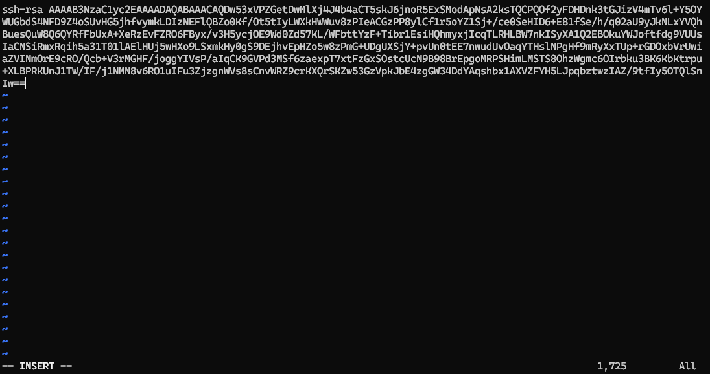

Save dan keluar dari vim dengan menekan `esc` lalu mengetikkan `:wq`

Kembali ke direktori home dengan cara 

    cd ~

Edit file konfigurasi ssh

    sudo vim /etc/ssh/sshd_config

Ganti konfigurasi sesuai screenshot dibawah

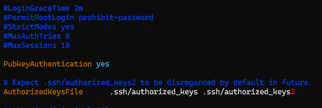

Save dan keluar dari vim dengan `esc` lalu `:wq`

Restart ssh dengan menggunakan command

    sudo systemctl restart ssh

Buka tab baru pada powershell windows lalu coba login lagi

    ssh user@ip_address -p 9005
(user diisi username dari ubuntu yang sudah dibuat, ip address bisa dicek pada ubuntu menggunakan command `ip a`)

Jika konfigurasi berhasil berarti saat login tidak diminta password

No password ygy

Kalo masih diminta password ya berarti nt njir ulang lagi dari awal

# Konfigurasi https server menggunakan nginx

Install nginx, php-fpm, php-mysql, openssl

    sudo apt install nginx php-fpm php-mysql openssl

Buat direktori baru di /var/www/html

    cd /var/www/html
    
lalu 

    sudo mkdir <nama_project>

(Misal `<nama_project>` bernama testing-website, maka gunakan testing-website setiap ada `<nama_project>`. Contoh `cd <nama_project>` maka menjadi `cd testing-website`)

Masuk ke direktori yang telah dibuat

    cd <nama_project>

Copy file php yang sudah disiapkan dari github

    sudo wget https://raw.githubusercontent.com/Rizqirazkafi/testing-website/main/index.php

Kembali ke direktori home dengan cara 

    cd ~

Buat file konfigurasi dengan nama `default.conf` pada `/etc/nginx/conf.d` dengan cara

    cd /etc/nginx/conf.d

lalu

    sudo touch default.conf

Buka file default conf

    sudo vim default.conf

Masuk mode edit dengan klik `i` hingga muncul label `--INSERT--` pada pojok kiri bawah

Copy dan paste konfigurasi berikut

    server {
            listen 80;
            server_name  <ip_address>;

            location / {
                root   /var/www/html/<nama_project>;
                index  index.html index.htm index.php;
            }

    }

(ip_address bisa dilihat pada `ip a`)

Save dan quit dari vim dengan klik `esc` lalu ketik `:wq`

Kembali ke direktori home dengan cara 

    cd ~

Buat file html pada `/var/www/html/<nama_project>` untuk mencoba apakah konfigurasi sudah benar

    cd /var/www/html/<nama_project>

lalu 
    
    sudo touch index.html

Buka file html

    sudo vim index.html

Masuk mode edit dengan klik `i` hingga muncul label `--INSERT--` pada pojok kiri bawah

Copy dan paste kode berikut

    <!doctype html>
    <html>
            <head>
                    <title>
                            Testing website
                    </title>
            </head>

            <body>
                    <h1>Lorem ipsum</h1>
                    
Lorem ipsum dolor sit amet

            </body>
    </html>

Save dan quit dari vim dengan klik `esc` lalu ketik `:wq`

Kembali ke direktori home dengan cara 

    cd ~

Restart nginx dengan command 

    sudo systemctl restart nginx

Buka browser lalu ketikkan ip address pada searchbar

Jika muncul tampilan seperti ini, berarti konfigurasi sudah benar

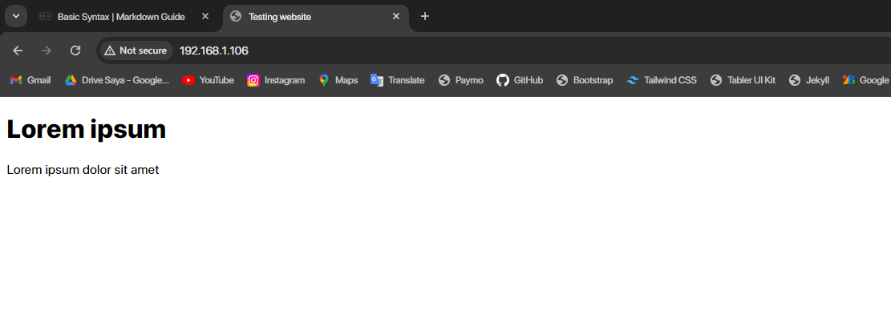

Lanjut biar nginx bisa baca file php (gunanya install php-fpm biar nginx bisa eksekusi php njir)

Cek dulu versi php dengan cara

    sudo systemctl status php 
    
jangan langsung di enter melainkan di tab (pencet tab pada keyboard)

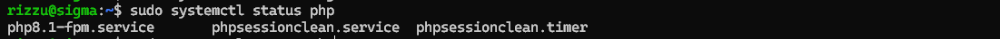

Lihat pada file `php8.1-fpm.service` (jika php bukan versi 8.1, bisa jadi bernama `php7.4-fpm.service` misal php versi 7.4 atau bisa jadi hanya ada `php-fpm.service`)

Enable php-fpm service (enable biar ga perlu start tiap nyalain ubuntu)

    sudo systemctl enable --now php8.1-fpm
(sesuaikan dengan versi php seperti cara diatas)

Jika seperti ini berarti tidak ada error (kalo error gw gatau, soalnya ga error punya gw)

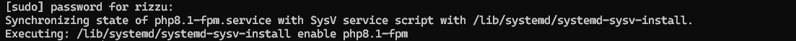

Konfigurasi `default.conf`

    sudo vim /etc/nginx/conf.d/default.conf

Masuk mode edit dengan klik `i` hingga muncul label `--INSERT--` pada pojok kiri bawah

Tambahkan konfigurasi berikut dibawah `location`

     location ~ \.php$ {
        root /var/www/html/<nama_project>;
        index index.html index.htm index.php;
        include snippets/fastcgi-php.conf;
        fastcgi_pass unix:/var/run/php/php8.1-fpm.sock;
     }

(nama_project sesuaikan dengan nama direktori yang dipakai untuk menyimpan file php)

Sesuaikan versi php pada `php-fpm.sock` (karena menggunakan php8.1 maka `php8.1-fpm.sock`)

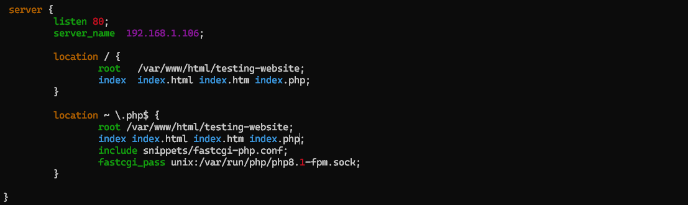

Restart nginx dan php-fpm

    sudo systemctl restart nginx php8.1-fpm

Lalu pergi ke browser dan coba akses `<ip_address>/index.php` (ip_address sesuaikan)

Jika seperti ini berarti nginx sudah bisa mengeksekusi file php

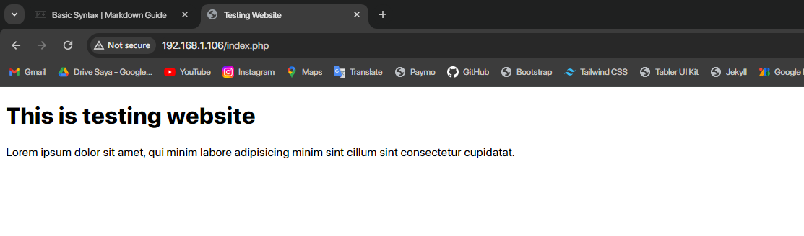

###### Opsional
Jika sudah, file `index.html` yang digunakang sebagai tester bisa dihapus (biar bisa direct langsung ke `index.php` saat mengakses ip address)

Masuk ke direktori `<nama_project>` (direktori yang menyimpan `index.php`)

    cd /var/www/html/<nama_project>  
(direktori yang menyimpan `index.php`) lalu 

    sudo rm index.html 

(menghapus file index.html)

Kembali ke home direktori dengan mengetikkan `cd ~`

###### Dah lanjut yang harus(wajib)

Lanjut https

Generate SSL Certification menggunakan openssl dengan menjalankan command berikut

    sudo openssl req -x509 -nodes -days 365 -newkey rsa:2048 -keyout /etc/ssl/private/nginx-selfsigned.key -out /etc/ssl/certs/nginx-selfsigned.crt

Akan disuruh mengisi banyak fields (isi random/asal saja karena ini cuma local njir bukan production)

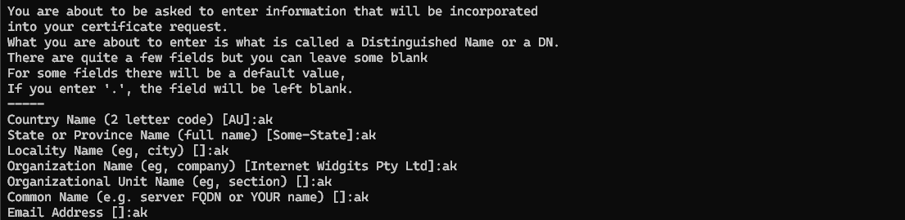

Pergi ke `default.conf` lagi

    sudo vim /etc/nginx/conf.d/default.conf

Masuk mode edit dengan klik `i` hingga muncul label `--INSERT--` pada pojok kiri bawah

Lalu ganti `listen` dan tambahkan `ssl_certificate` yang sudah digenerate

    listen 443 ssl;
    ssl_certificate /etc/ssl/certs/nginx-selfsigned.crt;
    ssl_certificate_key /etc/ssl/private/nginx-selfsigned.key;

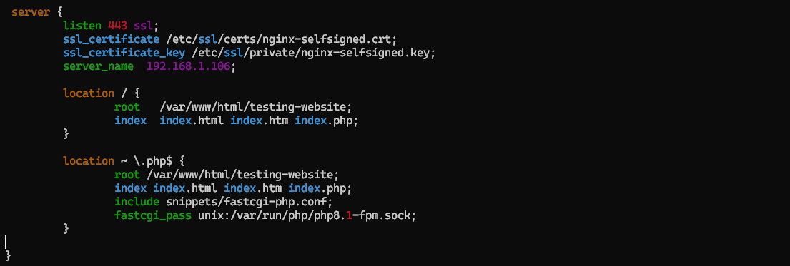

Restart nginx dan php-fpm

    sudo systemctl restart nginx php8.1-fpm

Pergi ke browser lalu ketikkan `https://<ip_address>` (ip_address sesuaikan)

Jika muncul peringatan seperti ini, klik advanced

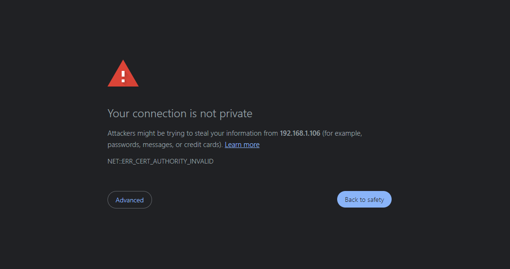

Lalu klik proceed to 192.168(unsafe)

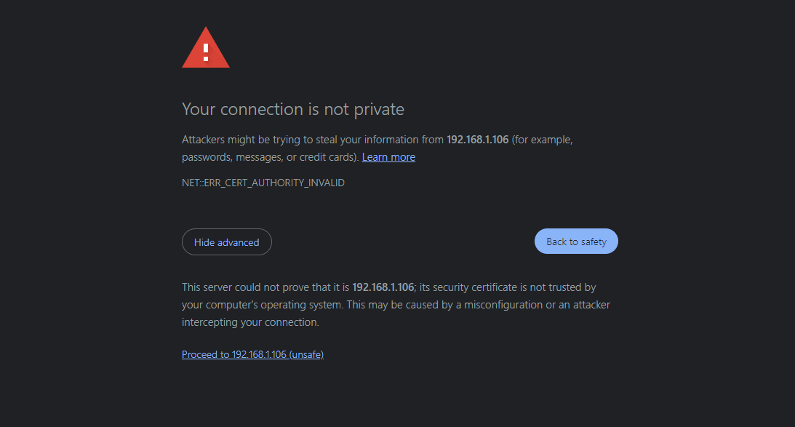

Kalo udah kek gini berarti udah selesai prakteknya yay (bisa diliat di linknya udah ada https didepan ip)

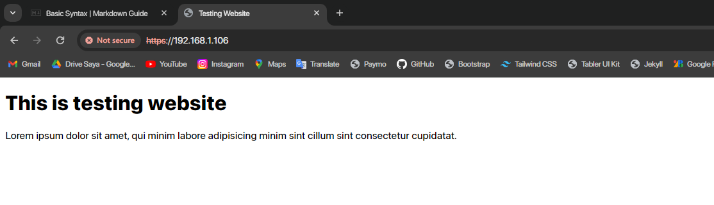