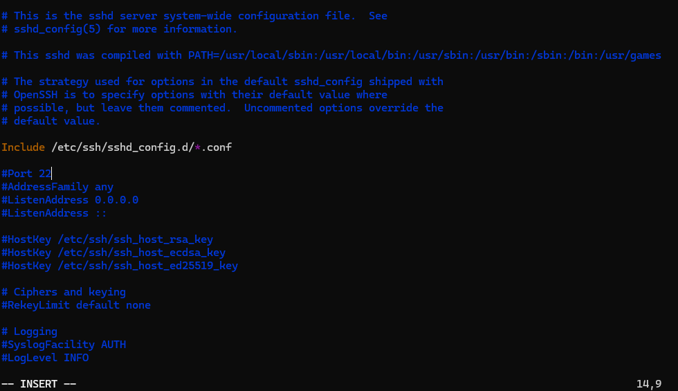
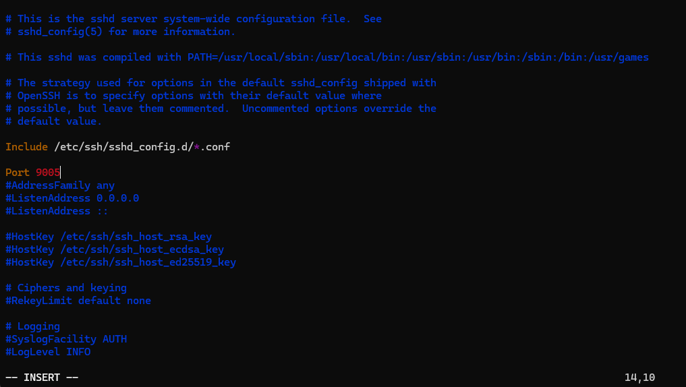
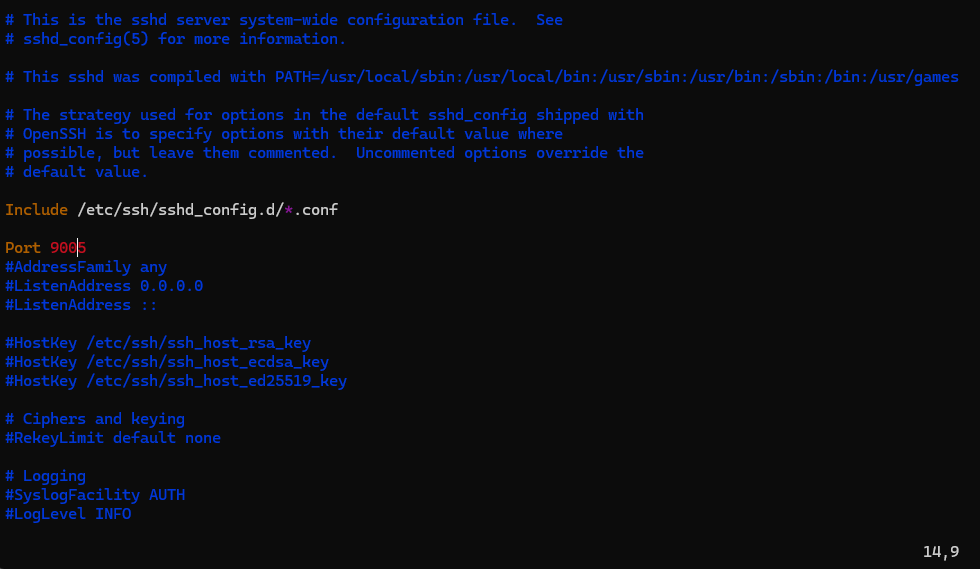
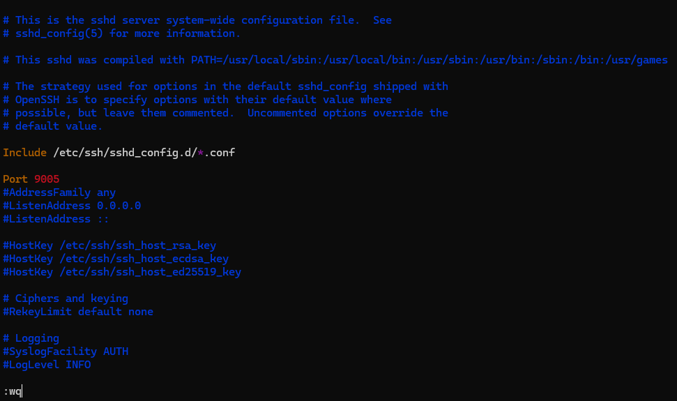
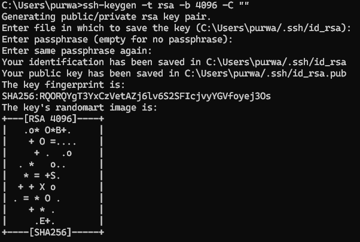
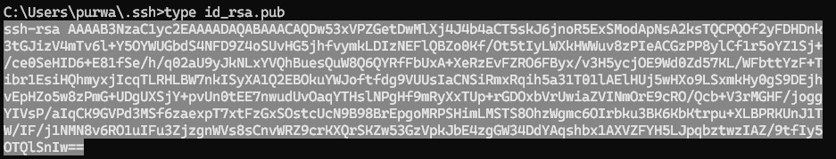
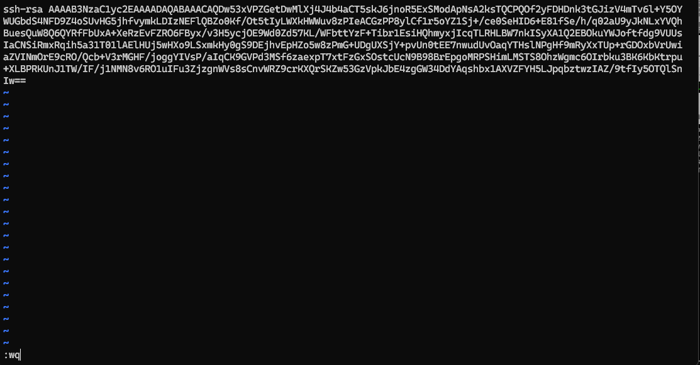
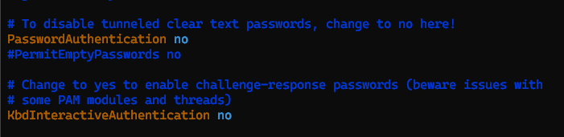
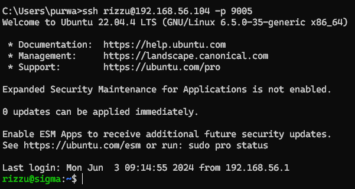

### Setup SSH menggunakan authentifikasi tanpa password

Install openssh-server
`sudo apt install openssh-server`

Install vim
`sudo apt install vim`

Buka windows powershell dan jalankan perintah berikut
`ssh user@ip_address` 
(user diisi username dari ubuntu yang sudah dibuat, ip address bisa dicek pada ubuntu menggunakan command `ip a`)

Konfigurasi file ssh
`sudo vim /etc/ssh/sshd_config`

Untuk mengedit file konfigurasi pada vim, tekan huruf `i` sampai ada label `--INSERT--` pada pojok kiri bawah

Ganti port menjadi 9005 dan hapus tanda pagar pada awal baris port (`#Port 22 -> Port 9005`)

Keluar dari mode edit dengan menekan `esc` hingga label `--INSERT--` pada pojok kiri bawah hilang

Save file konfigurasi dengan mengetikkan `:wq` lalu enter hingga kembali ke direktori awal

Restart ssh dengan mengetikkan
`sudo systemctl restart ssh`

Buka command prompt pada windows dan ketikkan command
`ssh-keygen -t rsa -b 4096 -C ""`
hingga muncul seperti ini

Copy key yang sudah digenerate tadi dengan mengetikan
`cd /.ssh`
lalu
`type id_rsa.pub`

Akan muncul key yang sudah digenerate tadi, select semua lalu copy key `ctrl+c`

Jika sudah, kembali ke windows powershell yang sudah login ubuntu tadi lalu ketikkan 
`sudo vim ~/.ssh/authorized_keys`

Klik `i` hingga muncul label `--INSERT--` pada pojok kiri bawah, lalu paste key yang sudah dicopy tadi

Save dan keluar dari vim dengan menekan `esc` lalu mengetikkan `:wq`

Jika sudah kembali ke direktori ubuntu, edit file konfigurasi ssh
`sudo vim /etc/ssh/sshd_config`

Ganti konfigurasi sesuai screenshot dibawah

Save dan keluar dari vim dengan `esc` lalu `:wq`

Restart ssh dengan menggunakan command
`sudo systemctl restart ssh`

Coba login menggunakan command prompt windows
`ssh user@ip_address -p 9005`
(user diisi username dari ubuntu yang sudah dibuat, ip address bisa dicek pada ubuntu menggunakan command `ip a`)

Jika berhasil berarti saat login tidak diminta password

No password ygy

Kalo masih diminta password ya berarti nt njir ulang lagi dari awal